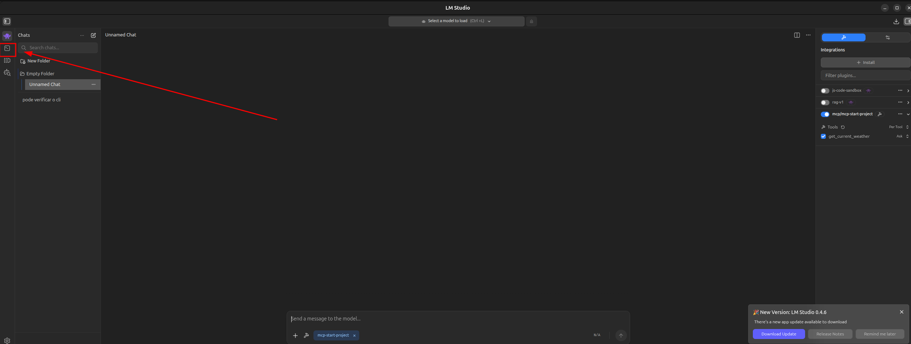
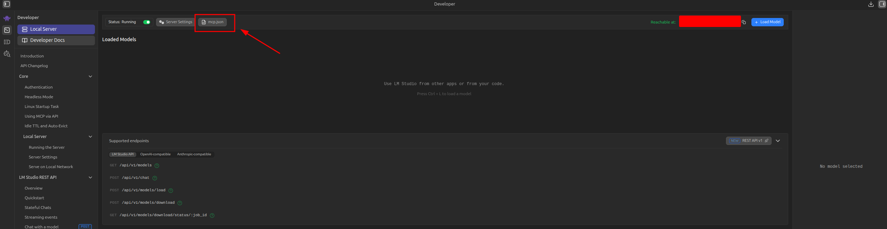
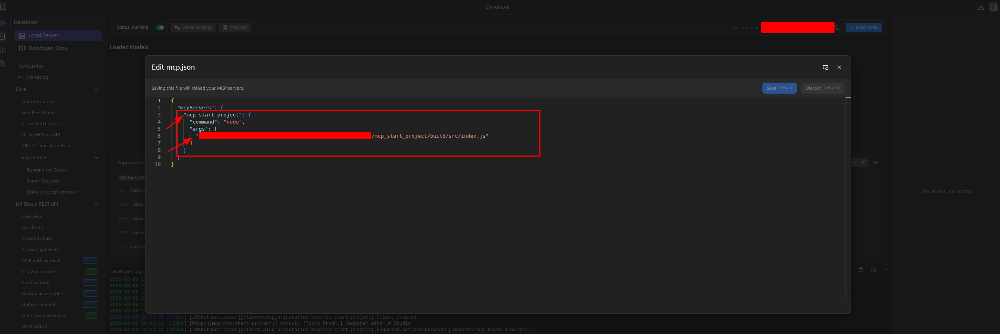

# Primeiro projeto MCP

Olá 👋 Obrigado por entrar no repositório, a ideia desse projeto é aprender sobre mcp e receber ideias sobre o tema.

MCP de clima atual


## Configurações

1 instalar node_modules:

```
npm install
```

2 Configurar o env:

O modo NODE_ENV development não precisa ter o cadastro na weatherapi porque os dados será em mock.

Modo production é feito a consulta na weatherapi em tempo real
```

NODE_ENV=development


WEATHER_BASE_URL=http://api.weatherapi.com/v1
WEATHER_API_KEY= <crie uma conta no site da weatherapi e copie a key>

```
3 Gerar o build

```
npm run build

```

### opcional
Caso não tenha instalado um software para usar um modelo tem como usar o comando `npm run inspector`para gerar um manu no chroma para usar os tools e resource. (modo de desenvolvimento)

4 Rodar o mcp `npm run start`

## Como conectar o MCP na interface do LM studio (Linux) ?

1 install
```
curl -fsSL https://lmstudio.ai/install.sh | bash

```

2 execute o LM Studio em sandbox (terminal):

```
lm-studio --no-sandbox
```

3 configure o caminho do arquivo index.js (gerado dentro do build)




altere o caminho para o index.js do build(caminho completo)
no vscode coloque o mouse em cima do icone do arquivo index.js do build e clique com o botão direito e vai até a opção copiar o caminho.


